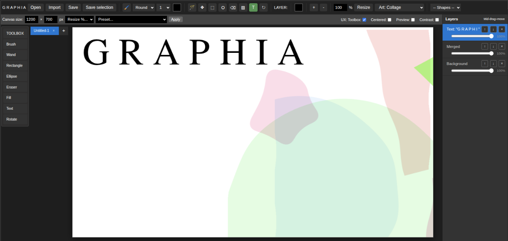

# Graphia Photo editor

A minimalist graphic photo editor to edit and create images, with drawing tablet support. 4000+ lines of JavaScript code, makes it very portable. Has the most used functions, for simplicity:

Image support:

PNG, JPEG, GIF, AVIF. (except for Firefox, which only support PNG blobs)

Menu:

- Open/save images files. (also: save a selection)
- Preview box
- Magic wand
- Brushes, styles: pencil, round, square, spray, rand. wih dedicated color picker.
- Drag/Pointer
- Resize a layer
- Rectangle
- Circles
- Flood Fill/Bucket
- Color picker
- Zoom +/-
- Text & System Fonts
- Eraser
- Rotate layers (left/right mouse button to rotate direction, snaps into place at certain angles)
- Canvas resizer
- Various standard effects/filters: blur, saturate, neon, hue, contrast, noise, etc.
- Custom Fabrik filters (folded paper, fine grain, rice paper, confetti, etc.)

Right menu:

Layers

- Add layer
- Delete layer
- Merge layers
- Dupe layer
- Move layer

Most popular shortcuts: `ctrl+e` to merge layers, `ctrl+c` to copy layer, `ctrl+v` to paste, `ctrl+x` to cut a layer.

TIP: Use `middle mouse button` to drag layers, or items around.

TIP: Many filters require good hardware. i.e. a fast CPU and GPU. At best, some filters take 3-10 seconds to be applied.

TIP: Firefox browser does not support (yet) anything else but PNG export when using blob.

# Graphia details

A browser-based layered image editor built with plain HTML5 Canvas and JavaScript - no build step, no dependencies. Open `index.html` and start drawing.

## Features

### Brush tools
- **Round** and **Square** brushes with smooth, curve-fitted strokes (freehand jitter is smoothed out in real time using quadratic-curve interpolation through recent points, rather than raw jagged line segments).
- **Spray** and **Rand** particle brushes for textured, scattered marks.
- Adjustable brush size (1–50px) and color for every brush type.
- **Pressure sensitivity** via the Pointer Events API - stroke width responds to pen pressure on graphics tablets (falls back to a fixed width for mouse input). Includes smoothing to avoid an oversized dot on first pen contact.
- **Straight-line mode**: hold <kbd>Shift</kbd> at any point during a brush stroke to snap the current segment into a straight line from an anchor point to your cursor, live-previewed as you drag. Toggle Shift on/off mid-stroke to mix straight and freehand segments in a single stroke.

### Selection & fill
- **Rectangle select** and **Ellipse select** tools.
- **Magic wand** selection by color/region.
- **Fill** tool - fills the current selection (rectangle or ellipse) with the active color, or flood-fills contiguous pixels when there's no selection.
- Copy, cut, and paste selections (<kbd>Ctrl+C</kbd> / <kbd>Ctrl+X</kbd> / <kbd>Ctrl+V</kbd>), and select-all (<kbd>Ctrl+A</kbd>).
- Save just the current selection out as its own image file.

### Shapes
A built-in library of vector shape templates you can stamp onto a new layer, auto-scaled to the canvas:
- **Basic**: line, box, triangle
- **Geometric**: circle, star, pentagram, diamond, pentagon, hexagon
- **Symbols**: cross, lightning bolt, house, zigzag, arrow, gear
- **Curves**: heart, spiral, infinity - drawn with smooth quadratic curves rather than straight segments

### Text
- Insert editable text as its own layer.
- Custom font family (type any font name, or pick from a bundled list of sans-serif, serif, monospace, and decorative system fonts).
- Optional **font detection** (Chrome/Edge) to pull in fonts actually installed on your machine.
- Adjustable font size.

### Layers
- Add, duplicate, delete, and reorder layers (drag to reorder, or move up/down buttons).
- Per-layer **visibility toggle**.
- Per-layer **opacity slider** (0–100%).
- **Merge selected layers** (<kbd>Ctrl+E</kbd>).
- Drag a layer around the canvas with the middle mouse button.
- Continuous layer **rotation** tool (left/right click-and-hold to rotate, with acceleration).
- Resize an individual layer independently of the canvas.

### Effects & filters
Apply any of the following to the active layer:
- **Transform**: flip horizontal, flip vertical, rotate 90° CW/CCW
- **Color**: brightness, contrast, saturation, hue shift, grayscale, sepia, invert, "neon" red/green/blue channel isolation
- **Adjustments**: opacity, noise, blur, drop shadow
- **Fill/replace**: fill layer with a color, interactive replace-color (with tolerance)
- **Textures & paper**: folded scrap paper, fine grain paper, fine rice paper, thin lines, ruled lines, laminate, brushed metal
- **Patterns**: sine wave, tangent, cosine, square wave, sawtooth, confetti (small/large), collage

### Canvas & document management
- Resizable canvas with a manual width/height input, percentage-based resize (10–200%), and a large library of size presets (common screen resolutions, social media formats, print sizes at 300dpi, and standard icon sizes).
- Multiple documents at once via tabs, each with its own layer stack.
- Zoom in/out (<kbd>+</kbd> / <kbd>-</kbd>) with a live zoom percentage readout.
- Live cursor coordinate readout and canvas size in the status bar.
- Optional thumbnail preview panel.
- Toggleable UI: collapsible toolbox, tab bar orientation, canvas centering, and a high-contrast UX mode.

### File I/O
- **Open** a PNG/image file, replacing the current document and resizing the canvas to match (<kbd>Ctrl+O</kbd>).
- **Import** an image as a new layer without touching canvas size or existing layers.
- **Save/export** as PNG, JPEG, GIF, or AVIF, with an adjustable quality slider for lossy formats (<kbd>Ctrl+S</kbd>).
- Save the current selection as a separate image file.

### Undo/redo
- Full undo history (<kbd>Ctrl+Z</kbd>) covering strokes, layer edits, effects, and canvas operations.

### Input support
- Mouse, touch, and pen/stylus input via the Pointer Events API.
- Pressure-sensitive tablets (e.g. XP-Pen, Wacom, Huion) work automatically once your OS/driver reports pressure to the browser - no per-brand configuration needed. Tablet **express keys** can be mapped to any of Graphia's keyboard shortcuts through your tablet driver's own settings app.

## Keyboard shortcuts

| Shortcut | Action |
|---|---|
| `V` | Pointer tool |
| `S` | Rectangle select |
| `C` | Ellipse select |
| `E` | Eraser |
| `F` | Fill |
| `T` | Text |
| `R` | Rotate layer |
| `Shift` (while drawing) | Straight-line brush mode |
| `Esc` | Clear current selection |
| `Ctrl+O` | Open file |
| `Ctrl+S` | Save file |
| `Ctrl+C` / `Ctrl+X` / `Ctrl+V` | Copy / cut / paste selection |
| `Ctrl+A` | Select all |
| `Ctrl+Z` | Undo |
| `Ctrl+I` | Invert colors on active layer |
| `Ctrl+E` | Merge selected layers |

## Getting started

No installation required - Graphia is a single self-contained HTML file.

1. Open `index.html` in a modern browser (Chrome, Edge, or Firefox). Note: Firefox does not support anything else but PNG export!
2. Pick a tool from the toolbox on the left.
3. Start a new canvas at a preset size, or open/import an existing image.

## Browser support

Built on standard HTML5 Canvas, Pointer Events, and File APIs. Works in any current Chromium-based browser or Firefox. Font detection is Chrome/Edge only (relies on the Local Font Access API). AVIF export depends on your browser's canvas encoder support.

## Tech notes

- No frameworks or build tooling - vanilla JS, a single `<canvas>` element per layer, composited on render.
- Freehand strokes are smoothed client-side via quadratic-curve interpolation over a 3-point rolling buffer; this is purely a rendering technique and doesn't store stroke vector data for later editing.
- Straight-line mode restores a pixel snapshot of the layer taken at the start of the current segment, then redraws the line on every pointer move - this keeps the live preview accurate without permanently baking in intermediate frames.
